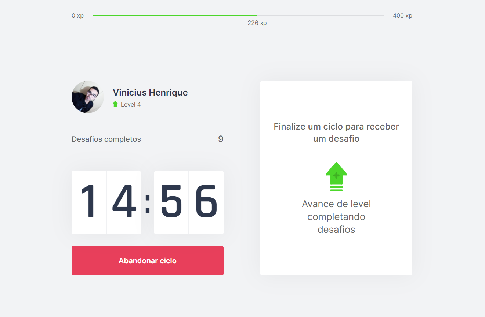
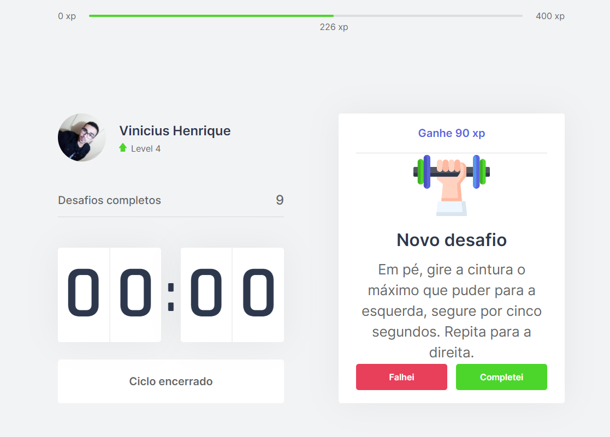

<h1 align="center">
  <a href="https://github.com/vinisioux/moveit">
    
  </a>
</h1>
<p align="center">
   
   
   
</p>

  <a href="http://github.com/vinisioux">
	
  </a>  
  
  
  
  

---
### :rocket: Technologies
This project is being developed using the following technologies:
- [TypeScript](https://www.typescriptlang.org/)
- [ReactJS](https://reactjs.org)
- [Styled Components](https://styled-components.com/)
---

### :dart: How To Run
To clone and run this application, you'll need [Git](https://git-scm.com), [Node.js](https://nodejs.org/en/) + [Yarn](https://yarnpkg.com/) installed on your computer. From your command line:

```bash
# Clone this repository
$ git clone https://github.com/vinisioux/moveit

# Go into the repository
$ cd moveit/

# Install dependencies
$ yarn install

# Start the server
$ yarn dev
```

Made by [Vinicius Henrique](https://github.com/vinisioux) 🚀
